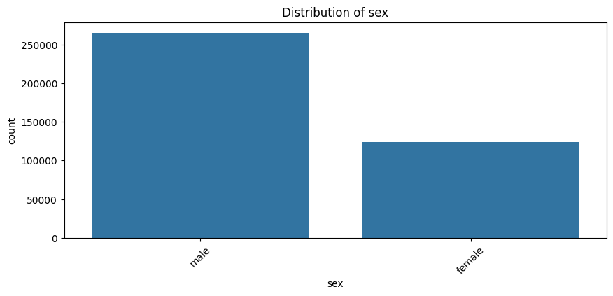
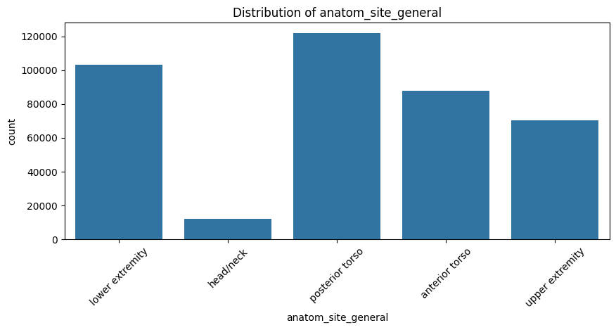
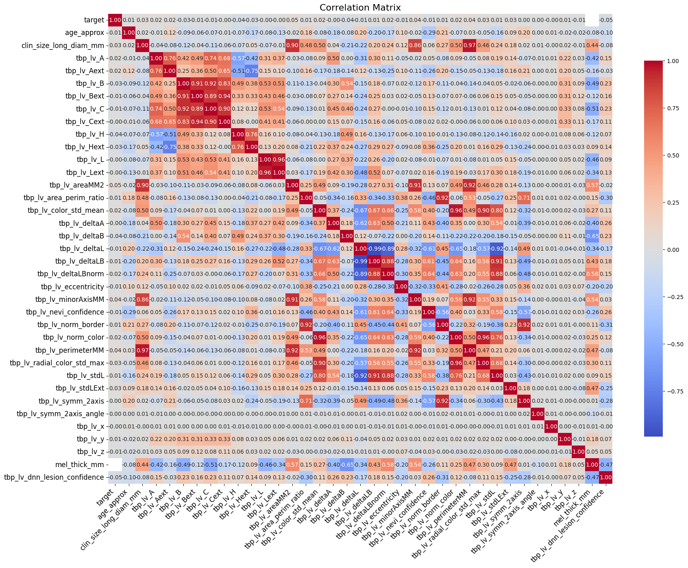
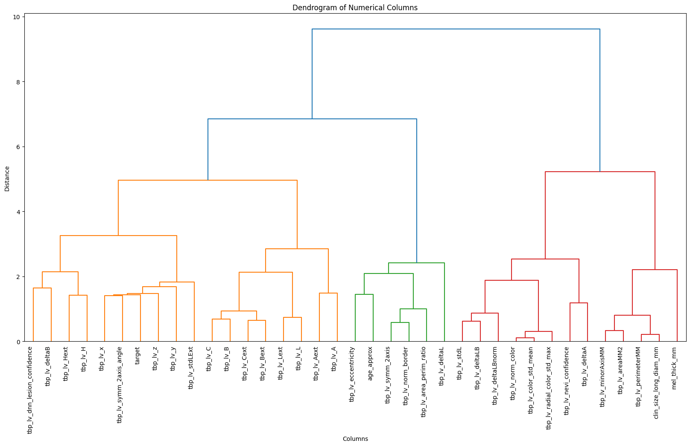

# cse151a_groupProject
summer session 1  2024

## Abstract:
The ISIC 2024 Skin Cancer Detection with 3D Total Body Photos (TBP) dataset aims to help clinicians in determining if patients are developing or have skin cancer to help with early detection of the disease. The dataset includes images of skin lesions which vary in range of severity from benign to malignant. The goal of our project is to create a model which can determine the probability (between 0 and 1) that the pictured skin lesion is malignant. To do so, we plan to explore pre-trained CNN models such as ResNet or ImageNet to train on the given train and test images. We will also explore building our own CNN model from scratch. We also plan to employ ensemble learning, combining multiple models together, to yield better performance for predicting probability that the case is malignant. 

## Data Exploration: 
Our initial data exploration was more focused on the metadata associated with the images than the images themselves. This allows to survey the full dataset in terms of feature analysis without having to actually parse all of the images (which would be infeasible given our time-constraints). However, it might be worth to later resample and recreate these figures with direct image data once we're able to. Compliance with the metadata trends would also suggest that our image parsing is accurate in terms of the relevant features. 

To begin with, distributions of features deemed most critical were plotted in order to understand existing trends or biases. An immediate trend noticed was that there were significantly more males than females present in the dataset. 

  

We can also see that most of the samples in the data are from regions outside the head. The head is underrepresented in the dataset and might be difficult to predict from our model. These kinds of skews in terms of sampling need to be more thoroughly examined and iteratively reassessed as we continually improve the model to potentially reweight traits and prevent overfitting to specific regions (or sexes).

  

Additionally, the correlation matrix and corresponding dendrogram showed us that we will have to construct some form of multivariate "index" variables to reasonable analyze the data. A lot of features are strongly related and measure similar biological characteristics. The orange cluster in the dendrogram contains multiple clear examples of this such as tbp_lv_x, tpb_lv_y, and tbp_lv_z. PCA might be a very useful tool for this analysis. 

  
  

The pairplot showcases a number of potential correlations, including some that seem directly linear. These features are worth analyzing and might even be worth preserving as is. However, it is important to note that the directly linearly correlated features also tend to be features that might be best clustered together via PCA and are similar to the examples present in the dendrogram. 

  

## For preprocessing we plan to implement the following:

Through EDA we have seen that there is a great class imbalance, so in turn we plan to apply affine transformations to our images using the keras ImageDataGenerator which makes batches of  tensor image data with real-time data augmentation. More simply it will create variation of data. We will implement transformations such as rotation, brightness, shear, zoom in, and reflection.  

  
Continuing there are some preprocessing techniques that are standard for skin cancer data sets such as the one we are using. Most notably we plan to implement enhancement and hair removal methods (time permitting). More specifically for enhancement we plan to use histogram equalization for contrast optimisation through OpenCV.
As for hair removal we will implement a common hair removal technique called generalized grayscale morphological closure operation . This process happens by performing a dilation followed by an erosion on a grayscale image. We found it in published research that summarized preprocessing techniques for skin cancer data (IEEE, 2019). 
### Here are the steps:   
#### Grayscale Morphological Closure:  
- Convert the image to grayscale.
- Apply a morphological closure operation to enhance dark regions, typically corresponding to hair.
#### Identifying Thin and Long Structures:
- Create a binary image by thresholding the closed image.
- Use connected component analysis to identify regions.
- Filter regions based on their aspect ratio to identify thin and long structures.
#### Bilinear Interpolation:
- Create a mask for identified hair pixels.
- Use surrounding non-hair pixels to interpolate and replace hair pixels with smoothed values.  

  
Hair removal can significantly help our model classification accuracy as they act as physical noise. 

Finally depending on the model we decide to make we may try segmentation techniques, however like hair removal it will be time permitting. 

All these methods should set up our data very well as long as we are mindful not to over augment the images. 

## Milestone 3:

### Updates:
The main thing we worked on for this milestone is model architecture. Our first model utalizes the ResNet18 architecture, which we customised for our implementation.

### How can we improve our current Model? 
Improvements to the current model would primarily consist of data augmentation and data pre-processing impmrovements. To prevent overfitting, rotation, flipping, color jittering, and perspective shifts can all be utilized. This helps the model become more generalized and prevent it from expecting a specific "format" of image structure or composition. Shifting hyperparameters such as the learning rate, batch size, and optimizer will also likely yield improved results. Additionally, more ambitious pre-processing approaches, such as removing hair from the images via masking, is also worth exploring. Hopefully this can be implemented successfully as it would likely be a significant improvement to the model. As this is a pre-trained model, there is limited modifications we can make to the architecture at this point. We will likely switch to a different model or even implement our own for future cases. 

### Where does the model fit in the fitting graph? 

At the moment from our plot it seems that our model is in the ideal range from model complexity since the error/loss on trading and test data is very close together and has not diverged yet. However we do note that there may be problems with visualizing the success of our model this way as it is a binary classifier, with data that is highly imbalanced, thus we plan to asses out future models using an ROC graph in order to gauge how well it is actually ‘learning’. Can see that the accuracy is very high but in a straight line that is unchanging, so that may imply that our model has overfit, or that it is not correctly classifying the malignant cases. 

### Conclusion of 1st Model
The 1st model had surprisingly decent results for a pre-trained model. However, it's important to note that the dataset has a huge skew towards target=0 (benign images). This means that the model could be incentivized to simply the image is benign when the model is insure. We will have to utilize better data sampling and larger penalizations for false negative predictions from the model. Most likely we will pivot away from this pre-trained model and experiment with more context-appropriate pre-trained models and potentially even constructing our own from scratch. 

### Future Models to Implementation
The primary model to work on next would be a custom CNN model. We would have to experiment with different architcture types and hyperparameters, but it would likely outperform pre-trained models. A CNN would be best-suited to this task as it can capture low-level features in the image (such as edges, shapes, and textures) which would be relevant for our given task. It's been proven to be effective in image classification tasks, including medical imaging, and we should probably stick to that established precedent. 

Aside from this however, a number of different pre-trained models may be worth exploring. DenseNet is a model with an interesting architecture (connecting every layer to every other layer) which is likely to improve performance. GoogLeNet uses different filtration for different layers meaning it might be able to pick up on distinct features. Attempting to utilize this Inception architecture to focus each layer on different features from the metadata files might be a particularly effective strategy. 

## Reference 

Image pre-processing in Computer Vision Systems for melanoma detection | IEEE conference publication | IEEE xplore. (n.d.-a). https://ieeexplore.ieee.org/document/8621507/ 
