# cse151a_groupProject

summer session 1 2024

## Abstract:

The ISIC 2024 Skin Cancer Detection with 3D Total Body Photos (TBP) dataset aims to help clinicians in determining if patients are developing or have skin cancer to help with early detection of the disease. The dataset includes images of skin lesions which vary in range of severity from benign to malignant. The goal of our project is to create a model which can determine the probability (between 0 and 1) that the pictured skin lesion is malignant. To do so, we plan to explore pre-trained CNN models such as ResNet or ImageNet to train on the given train and test images. We will also explore building our own CNN model from scratch. We also plan to employ ensemble learning, combining multiple models together, to yield better performance for predicting probability that the case is malignant.

## Data Exploration:

Our initial data exploration was more focused on the metadata associated with the images than the images themselves. This allows to survey the full dataset in terms of feature analysis without having to actually parse all of the images (which would be infeasible given our time-constraints). However, it might be worth to later resample and recreate these figures with direct image data once we're able to. Compliance with the metadata trends would also suggest that our image parsing is accurate in terms of the relevant features.

To begin with, distributions of features deemed most critical were plotted in order to understand existing trends or biases. An immediate trend noticed was that there were significantly more males than females present in the dataset.

  

We can also see that most of the samples in the data are from regions outside the head. The head is underrepresented in the dataset and might be difficult to predict from our model. These kinds of skews in terms of sampling need to be more thoroughly examined and iteratively reassessed as we continually improve the model to potentially reweight traits and prevent overfitting to specific regions (or sexes).

  

Additionally, the correlation matrix and corresponding dendrogram showed us that we will have to construct some form of multivariate "index" variables to reasonable analyze the data. A lot of features are strongly related and measure similar biological characteristics. The orange cluster in the dendrogram contains multiple clear examples of this such as tbp_lv_x, tpb_lv_y, and tbp_lv_z. PCA might be a very useful tool for this analysis.

  
  

The pairplot showcases a number of potential correlations, including some that seem directly linear. These features are worth analyzing and might even be worth preserving as is. However, it is important to note that the directly linearly correlated features also tend to be features that might be best clustered together via PCA and are similar to the examples present in the dendrogram.

  

## For preprocessing we plan to implement the following:

Through EDA we have seen that there is a great class imbalance, so in turn we plan to apply affine transformations to our images using the keras ImageDataGenerator which makes batches of tensor image data with real-time data augmentation. More simply it will create variation of data. We will implement transformations such as rotation, brightness, shear, zoom in, and reflection.  

  
Continuing there are some preprocessing techniques that are standard for skin cancer data sets such as the one we are using. Most notably we plan to implement enhancement and hair removal methods (time permitting). More specifically for enhancement we plan to use histogram equalization for contrast optimisation through OpenCV.
As for hair removal we will implement a common hair removal technique called generalized grayscale morphological closure operation . This process happens by performing a dilation followed by an erosion on a grayscale image. We found it in published research that summarized preprocessing techniques for skin cancer data (IEEE, 2019). 

### Here are the steps:  

#### Grayscale Morphological Closure:  

-   Convert the image to grayscale.
-   Apply a morphological closure operation to enhance dark regions, typically corresponding to hair.

#### Identifying Thin and Long Structures:

-   Create a binary image by thresholding the closed image.
-   Use connected component analysis to identify regions.
-   Filter regions based on their aspect ratio to identify thin and long structures.

#### Bilinear Interpolation:

-   Create a mask for identified hair pixels.
-   Use surrounding non-hair pixels to interpolate and replace hair pixels with smoothed values.  

  
Hair removal can significantly help our model classification accuracy as they act as physical noise.

Finally depending on the model we decide to make we may try segmentation techniques, however like hair removal it will be time permitting.

All these methods should set up our data very well as long as we are mindful not to over augment the images.

## Milestone 3:

### Updates:

The main thing we worked on for this milestone is model architecture. Our first model utalizes the ResNet18 architecture, which we customised for our implementation.

### How can we improve our current Model?

Improvements to the current model would primarily consist of data augmentation and data pre-processing impmrovements. To prevent overfitting, rotation, flipping, color jittering, and perspective shifts can all be utilized. This helps the model become more generalized and prevent it from expecting a specific "format" of image structure or composition. Shifting hyperparameters such as the learning rate, batch size, and optimizer will also likely yield improved results. Additionally, more ambitious pre-processing approaches, such as removing hair from the images via masking, is also worth exploring. Hopefully this can be implemented successfully as it would likely be a significant improvement to the model. As this is a pre-trained model, there is limited modifications we can make to the architecture at this point. We will likely switch to a different model or even implement our own for future cases.

### Where does the model fit in the fitting graph?

At the moment from our plot it seems that our model is in the ideal range from model complexity since the error/loss on trading and test data is very close together and has not diverged yet. However we do note that there may be problems with visualizing the success of our model this way as it is a binary classifier, with data that is highly imbalanced, thus we plan to asses out future models using an ROC graph in order to gauge how well it is actually ‘learning’. Can see that the accuracy is very high but in a straight line that is unchanging, so that may imply that our model has overfit, or that it is not correctly classifying the malignant cases.

### Conclusion of 1st Model

The 1st model had surprisingly decent results for a pre-trained model. However, it's important to note that the dataset has a huge skew towards target=0 (benign images). This means that the model could be incentivized to simply the image is benign when the model is insure. We will have to utilize better data sampling and larger penalizations for false negative predictions from the model. Most likely we will pivot away from this pre-trained model and experiment with more context-appropriate pre-trained models and potentially even constructing our own from scratch.

### Future Models to Implementation

The primary model to work on next would be a custom CNN model. We would have to experiment with different architcture types and hyperparameters, but it would likely outperform pre-trained models. A CNN would be best-suited to this task as it can capture low-level features in the image (such as edges, shapes, and textures) which would be relevant for our given task. It's been proven to be effective in image classification tasks, including medical imaging, and we should probably stick to that established precedent.

Aside from this however, a number of different pre-trained models may be worth exploring. DenseNet is a model with an interesting architecture (connecting every layer to every other layer) which is likely to improve performance. GoogLeNet uses different filtration for different layers meaning it might be able to pick up on distinct features. Attempting to utilize this Inception architecture to focus each layer on different features from the metadata files might be a particularly effective strategy.

## Reference

Image pre-processing in Computer Vision Systems for melanoma detection | IEEE conference publication | IEEE xplore. (n.d.-a). https://ieeexplore.ieee.org/document/8621507/

## Milestone 4:

1.  # **Introduction To Your Project**

    1. This project is particularly important due to the fact that it addresses the early detection of skin cancer. This disease can have life-threatening consequences for many people, but, when detected early, has a much higher chance of treatment/recovery. A model that can utilize minimally-invasive, accessible data like a photograph to distinguish benign/malignant tumors would be an extremely useful tool for the diagnosis process. Quick and reliable results would become widely accessible to healthcare providers and greatly improve rates of early detection.

1.  # **Methods Section**

    1.  **Data Exploration**  
        Our initial data exploration focused primarily on the metadata associated with the images. This approach allows us to survey the full dataset in terms of feature analysis without the need to parse and analyze the features of all the images. We will be able to identify trends in features we expect to analyze as well as provide us with an understanding of biases that may exist in the dataset.
        To begin with, we plotted the distributions of the most critical features to understand the existing trends or biases. An immediate observation was a significant gender imbalance, with notably more males than females in the dataset. This imbalance, however, is likely irrelevant towards the analysis of our dataset for the purpose of diagnosis.
        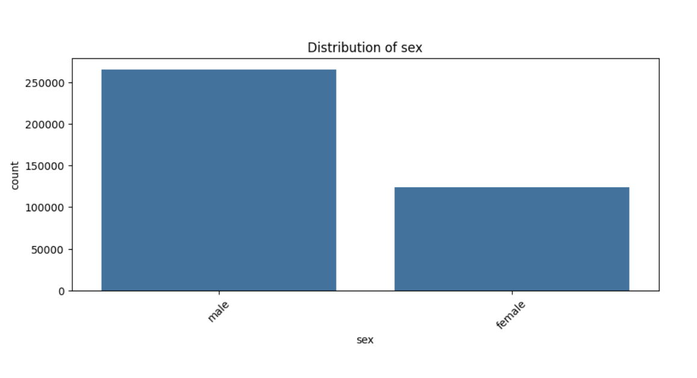  
        Furthermore, we observed that most samples in the data are from regions outside the head. This indicates that the head is underrepresentation might pose a challenge for our model in predicting lesions in the head area. We will have to experiment with hyperparameters and data stratification to see if we can address biases like this.
        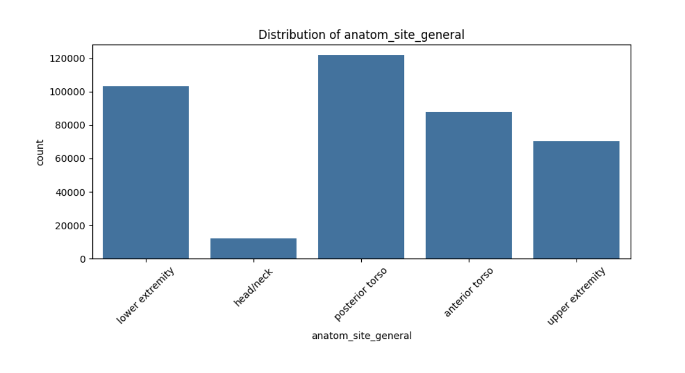  
        Additionally, the correlation matrix and corresponding dendrogram showed us closely related traits. While this information was not particularly useful in the overall design of our model as we would not be able to extract many of these metrics as independent features (like thickness, diameter, perimeter, etc.), it still showed us what biological traits were closely related. It also gave us insight into what features might be worth focusing on or prioritizing our model towards.
        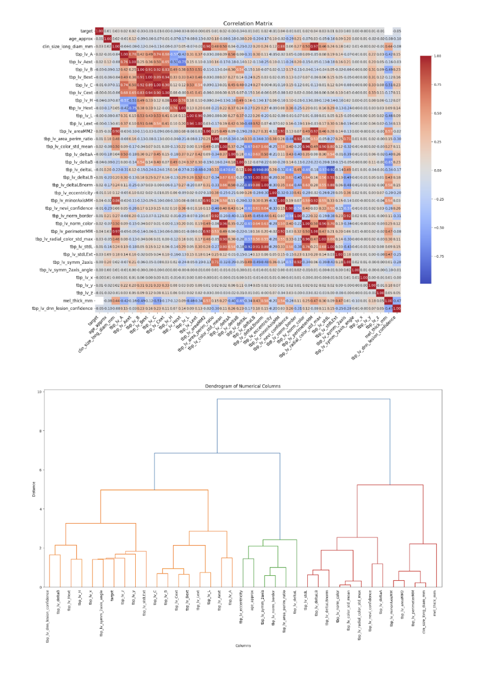  
        The pairplot further elaborates on this information by showing us which biological features are most correlated with one another. If a lot of strongly weighted features are strongly correlated or if a lot of weakly weighted features are strongly correlated, it could hint at some relevant features we can artificially weight with stratification or pre-processing (i.e. if the color data is found to be relatively irrelevant, pre-processing the data to use grayscale would help prevent fitting the model to data that could throw it off).
        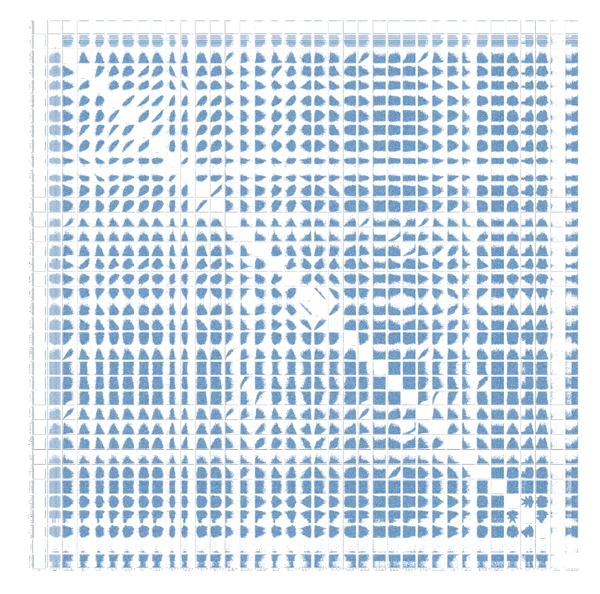  

    1.  **Preprocessing**
        1. **Hair Removal \-** For image preprocessing, we tried to implement a hair removal algorithm consisting of Grayscale Morphological Closure, identifying thin and long structures which are the individual hair strands, and bilinear interpolation. Although we did not get a working version of this preprocessing technique, we wanted to try and implement it because it could have increased the accuracy for our model by using cleaner images. For Grayscale Morphological Closure, our goal was to convert the image to grayscale and apply a morphological closure operation in order for us to enhance the darker regions of the image which in this case would correspond to hairs. Then, to identify thin and long structures corresponding to the hair follicles, we created a binary image and identified selected regions corresponding and filtered these according to aspect ratio in order to get the hair strands. Lastly, the bilinear interpolation involves creating a mask for the hair pixels that we have found, and then using the areas surrounding this to populate and replace the areas with hair. The ideal end result would be an image with all the hair removed so that our model is able to run on a completely clean image in order to see whether the lesion is malignant or benign. Unfortunately, we did not get a fully functioning version of this due to time constraints.
    1.  **Resnet**
        1. For our initial model, we utilized a pretty simple preprocessing step (conversion to a PIL, resizing to ResNet’s preferred resolution, transform to tensor \+ normalization) and the Resnet18 pre-trained model. We wanted to use this as a baseline for future iterations and Resnet18 was a good starting point as it was a well-regarded model with a wide pre-training dataset, strong benchmarks, generalized nature, and efficient runtime. More specific/niche models could be implemented based on the observed performance here.
    1.  **Logistic with Polynomial Features**
        1. We did a logistic regression using polynomial features, one with a single feature ‘tbp_lv_color_std_mean’ and another with two features ‘tbp_lv_color_std_mean', 'age_approx’. We used these features and we speculated that these features could be the most influential in determining whether a lesion was benign or cancerous.
    1.  **Logistic**
        1. We did a single logistic regression with the two features ‘tbp_lv_area_perim_ratio’ and ‘clin_size_long_diam_mm’. We chose these features because we speculated that there could be a relationship between these two features, which could then be used to determine if the lesion was benign or cancerous. Out of the models we covered in class, we believed that a logistic regression was a straightforward method of binary classification (as opposed to an ordinary polynomial or linear regression).

1.  # **Results Section**

    1.  **Preprocessing**
        1. \*\*Hair Removal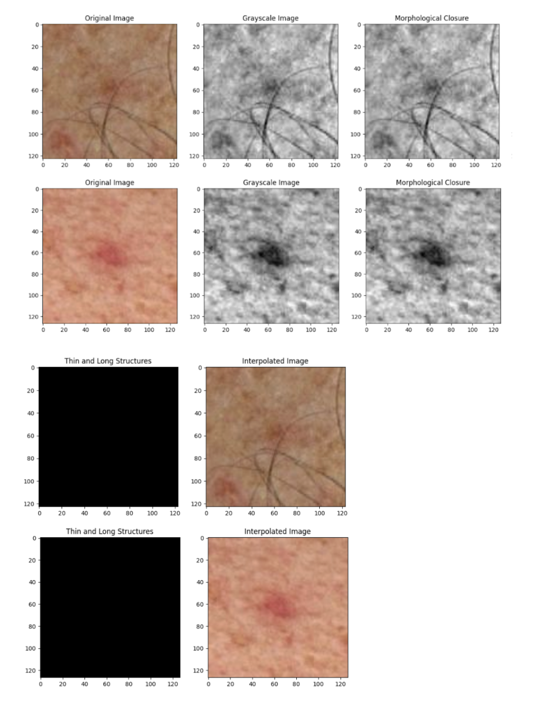  
           As you can see above, we were not successfully able to complete the hair removal preprocessing as we are able to get a grayscale and morphological closure, but ran into issues with identifying the thin and long structures of the image and returning the proper interpolated image without any hair follicles.
    1.  **Resnet18**  
        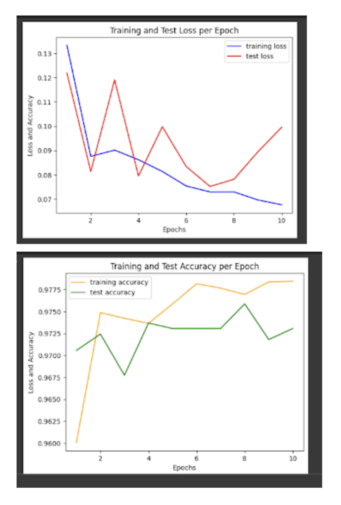  
        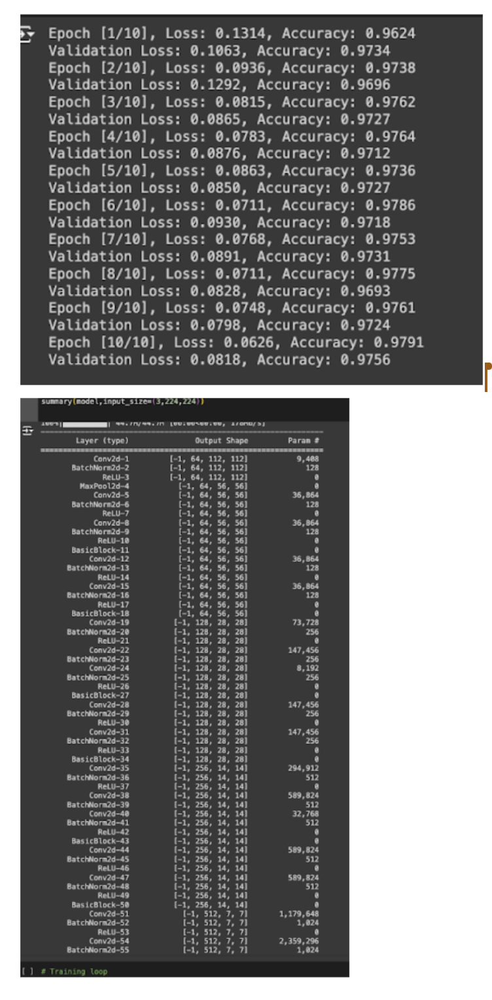  
        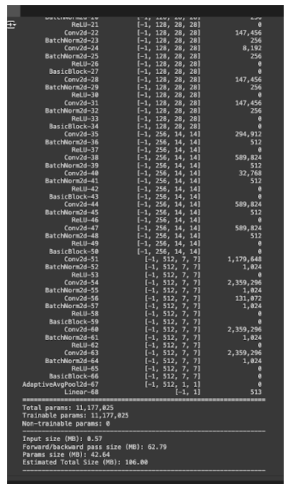  
    1.  **Logistic with Polynomial Features**

        1.  Single feature binary cross-entropy loss 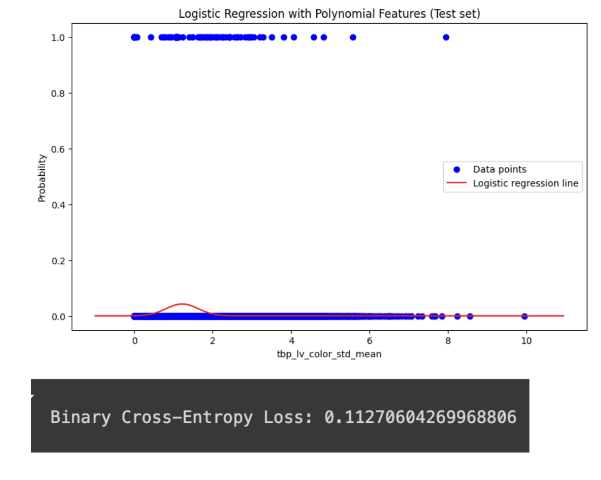  

        1.  Double feature Binary Cross-Entropy Loss
            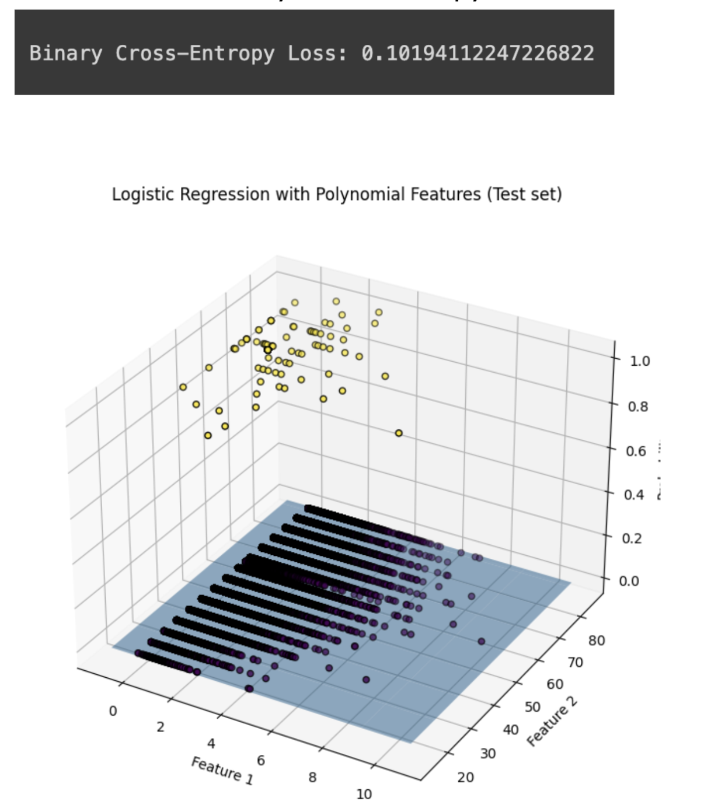  

    1.  **Logistic**

        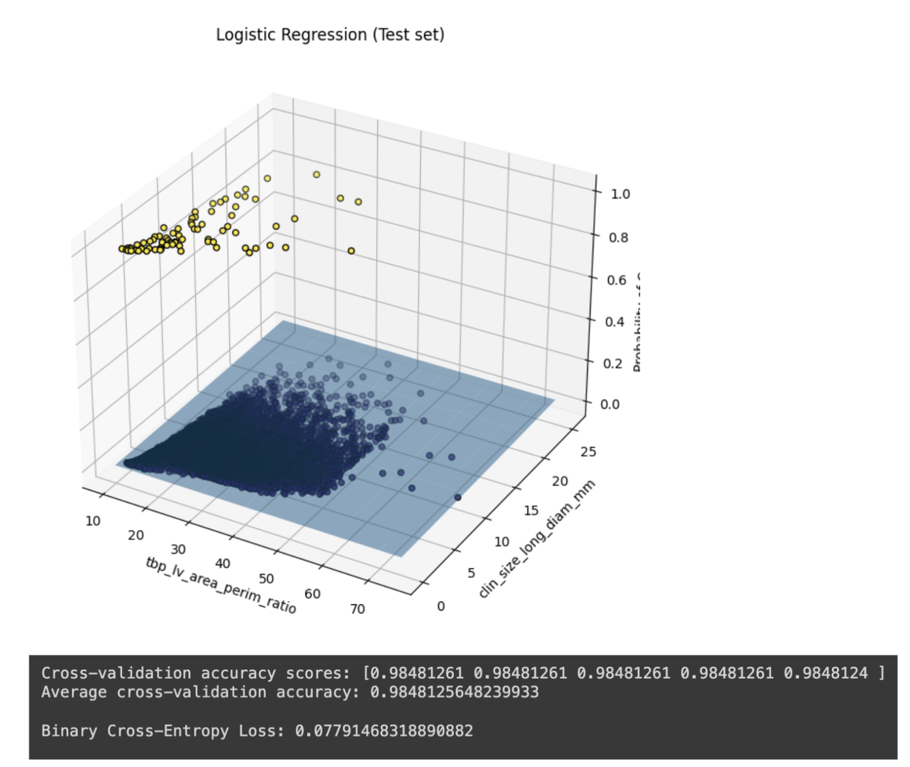  

1.  **Second Logistic Regression**  
     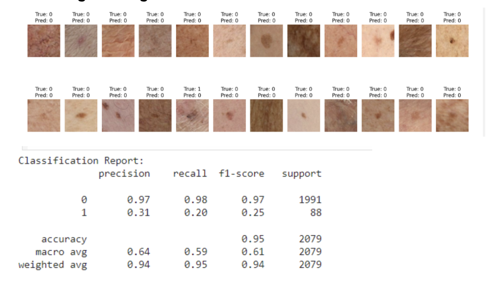  

1.  # **Discussion Section**

    1. Preprocessing \- Although we attempted to do a hair removal image preprocessing step, we were not able to get it fully working. I think one of the issues we ran into when trying to do this process was that for identifying things and long structures and bilinear interpolation we needed a mask and mask data. This was confusing because we did not have access to this data and were a little lost in how to proceed. If done correctly, the preprocessing file would be able to remove any hairs that exist on the image, especially the lesion portion, which could hinder our model efficacy to some extent.
    1. Logistic regression; double feature \- Since our ultimate goal was to detect cancer based on images of skin lesions, it made sense to use a simple logistic regression for classification. More specifically, we wanted to use features that might have the most influence on whether the lesion was benign or cancerous, so we chose the total lesion area to perimeter ratio and longest diameter (mm) as they also give strong visual clues for the model to learn from. Establishing a baseline using a straightforward model like a logistic regression also allows us to compare the results of more complex models. We used two measurements for accuracy: cross-validation and binary cross-entropy loss. We wanted to reduce the variance associated with a single train-test split, so using cross-validation provided us with a more robust estimate of the model’s performance. Furthermore, we wanted to ensure that the model doesn’t confidently give a wrong prediction, so by using binary cross-entropy loss we were able to penalize the model when it made an incorrect prediction. In regards to the cross-validation specifically, the consistent results indicate that the model did not overfit to a particular subset of the data, which is ideal for unseen data. However, given that logistic regression assumes a linear relationship between the features, it is possible that the two features chosen interact in nonlinear ways (besides just numerically) that the model cannot capture. In terms of how the model could be improved, methods such as regularization could help generalize across the multiple datasets instead of overfitting to any single dataset.
    1. Second Logistic regression function; while the previous logistic regression approach used specific features (area to perimeter ratio and longest diameter), the second logistic regression function used the raw pixel values from the images after being resized. This implementation faced a convergence issue due to the very high dimensionality of the pixel data. While this implementation had a high accuracy, it had issues with class imbalances, for example it had a low recall for images of skin cancer.
    1. Logistic regression with polynomial features; single and double feature – We chose to do another logistic regression, but with polynomial features as the polynomial features would allow the model to capture non-linear relationships between the features and the target variable. We chose the feature ‘tbp_lv_color_std_mean’ for the single feature and ‘age_approx’ in addition to ‘tbp_lv_color_std_mean’ for the double feature as we thought there could be a strong correlation for those features. For the model’s performance, the low binary cross-entropy loss (0.1127 for single feature and 0.1019 for double feature) indicates that the model’s predicted probabilities are close to the actual class labels.
    1. Resnet18: The first figure shows the training loss vs testing loss of the resnet18 model. We chose 10 epochs as this is the “golden number” in computer vision models. We can see from the blue line that our training loss steadily decreases over time. This is to be expected, as our model is simply predicting a binary 0 or 1 based on if the image is malignant or not. The size of the training set was \~20k images, with the majority of them being benign. The test loss is much different, as we first decrease, then increase, then find our lowest loss around epoch 7 before the test loss starts to increase again. The accuracy for both the training and test sets

1.  # **Conclusion**

    1. This is where you do a mind dump on your opinions and possible future directions. Basically what you wish you could have done differently. Here you close with final thoughts.
    1. Our goal from the beginning was to develop a model capable of early skin cancer detection, with image-derived features. Although we did not have a fully accurate model by the end, this experience has demonstrated to us the importance and capabilities of machine learning. While the models we implemented showed some promise, in retrospect we could have implemented more specialized models that were not covered in class, in addition to methods like combining more features and better balanced data. Based on the results we got, it seems like Resnet18 was the most successful model, although it was also the most sophisticated model. If we had more time, model ensembling would have been worth exploring, as we already have multiple different models that could have been combined. Better preprocessed data with more malignant samples would have also likely made this process smoother. While we did attempt to implement a hair removal algorithm, in the future we would have liked to get this algorithm fully working, which would likely contribute to higher quality data altogether. Overall, this project opened our eyes up to the power and versatility of machine learning and we hope to continue to try and harness this to help solve real world problems.

1.  # **Statement of Collaboration**

    1. Srivatsa Gangavarapu, Group Member: Contributed to code and report
    1. Michael Hu, Group Member: Contributed to code and report
    1. Ritviksiddah Penchala, Group Member: Contributed to code and report
    1. Donovan Sanders, Group Member: Contributed to code and report
    1. Akhil Subbarao, Group Member: Contributed to code and report
    1. Lobna Kebir, Group Member: Contributed to code and report
